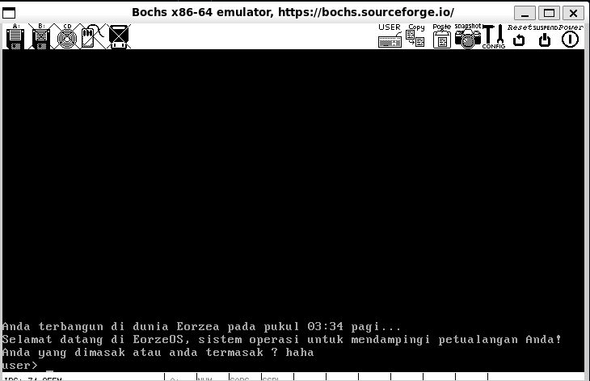
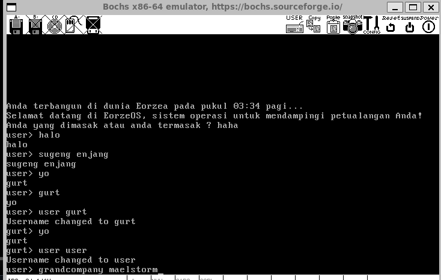
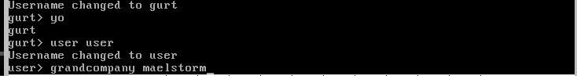
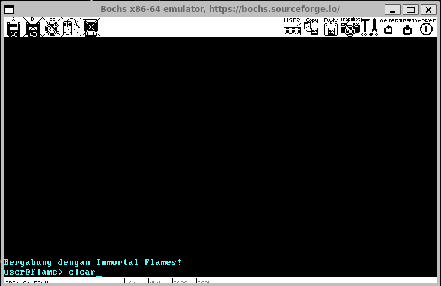
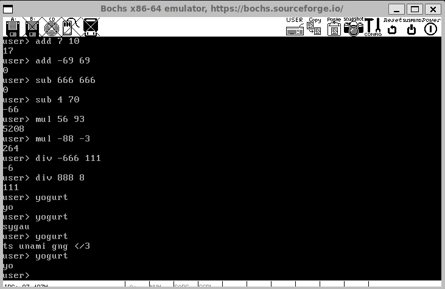

# Sisop-5-2025-IT16

## Kelompok

# LAPORAN PRAKTIKUM MODUL-5 #
## Praktikum Sistem Operasi Kelompok IT16 ##

| Nama | NRP       |
|-------|-----------|
| Ahmad Syauqi Reza | 5027241085   |
| Mochammad Atha Tajuddin   | 5027241093  |
| Tiara Fatimah Azzahra   | 5027241090  |
---

## Daftar Isi

- [Kelompok](#kelompok)
- [Daftar Isi](#daftar-isi)
- [Soal](#soal)
- [Petunjuk Soal](#petunjuk-soal)
  - [Source](#source)
  - [Headers](#headers)
  - [Makefile](#makefile)
  - [Video Demonstrasi](#video-demonstrasi)
- [Laporan](#laporan)

## Soal

Pada suatu hari, anda merasa sangat lelah dari segala macam praktikum yang sudah ada, sehingga anda berencana untuk tidur yang nyenyak di sebuah jam 3:34AM yang cerah. Tetapi, anda terbangun di dalam dunia berbeda yang bernama "Eorzea". Ada sesuatu yang mengganggu pikiran anda sehingga anda diharuskan membuat sebuah operating system bernama "EorzeOS" untuk mendampingi diri anda dalam dunia ini.

1. Sebagai seorang main character dari dunia ini, ternyata anda memiliki kekuatan yang bernama "The Echo", kekuatan ini memungkinkan anda untuk berbicara pada Operating System ini (mungkin sebenarnya bukan ini kekuatannya, tetapi ini cukup kuat juga), dengan tujuan agar semua hal yang anda katakan, bila bukan merupakan sebuah command yang valid, akan mengulang hal yang anda katakan.

   Ilustrasi:
   ```
   user> Hello!
   Hello!
   user> I have the Echo
   I have the Echo
   ```

2. gurt: yo

   Ilustrasi:
   ```
   user> yo
   gurt
   user> gurt
   yo
   ```

3. Seorang main character memerlukan sebuah nama yang semua orang bisa ingat dengan baik. Buatlah sebuah command yang memungkinkan pengguna untuk mengubah nama user pada shell yang digunakan:
   * `user <username>` = mengubah username menjadi `<username>`
   * `user` = mengubah username menjadi default `user`
   
   Ilustrasi:
   ```
   user> user Tia
   Username changed to Tia
   Tia> user
   Username changed to user
   user>
   ```

4. Tiga negara besar dari Eorzean Alliance butuh bantuan anda untuk ikut serta dalam "Grand Company" mereka sehingga anda bisa mengubah warna terminal ajaib anda sesuai warna utama dari company mereka:
   * `grandcompany maelstrom` = clear terminal, ubah semua teks berikutnya jadi merah
   * `grandcompany twinadder` = clear terminal, ubah semua teks berikutnya jadi kuning
   * `grandcompany immortalflames` = clear terminal, ubah semua teks berikutnya jadi biru
   * `grandcompany <selain atau kosong>` = tunjukkan error message
   * `clear` = clear terminal, ubah semua teks berikutnya kembali jadi awal (para Grand Company sedih kamu netral)

   Selain mengubah seluruh warna terminal, nama anda di dalam terminal akan diberikan tambahan nama judul Grand Company:
   * Maelstrom = `user@Storm`
   * Twin Adder = `user@Serpent`
   * Immortal Flames = `user@Flame`
   * `clear` = menghapus nama grand company

   Ilustrasi:
   ```
   gurt> grandcompany maelstrom
   -- terminal clear menjadi warna merah --
   gurt@Storm> clear
   -- terminal clear menjadi warna putih --
   ```

5. Sebagai pahlawan terkenal di antara ketiga negara besar Eorzean Alliance, salah satu supplier senjata terbesar di seluruh Eorzea bernama "Rowena's House of Splendors" tiba-tiba memerlukan bantuan anda untuk membuat sebuah sistem kalkulator sederhana melalui command karena pemimpin mereka tertidur setelah mengurus semua orang di dalam Eorzea:
   * `add <x> <y>` = x + y
   * `sub <x> <y>` = x - y
   * `mul <x> <y>` = x * y
   * `div <x> <y>` = x / y

   Ilustrasi:
   ```
   user> add 4 2
   6
   user> sub 4 2
   2
   user> mul 3 -2
   -6
   user> div -6 -2
   3
   ```

6. me: yogurt
   
   gurt:
   * `yo`
   * `ts unami gng </3`
   * `sygau`

   pilih secara *random*

   Ilustrasi:
   ```
   user> yogurt
   gurt> yo
   user> yogurt
   gurt> ts unami gng </3
   user> yogurt
   gurt> sygau
   ```

8. Perusahaan mesin "Garlond Ironworks" tiba-tiba lelah mengurus permintaan senjata perang untuk orang ke-148649813234 yang berusaha menghadapi final boss yang sama, sehingga mereka perlu bantuan kamu untuk melengkapi `Makefile` yang diberikan dengan command-command yang sesuai untuk compile seluruh operating system ini.

## Petunjuk Soal

### Source

* [kernel.asm](src/kernel.asm)
  * `_putInMemory`: penjelasan terdapat dalam modul
  * `_interrupt`: fungsi untuk interrupt
    * `number`: interrupt vector number
    * `AX`,`BX`,`CX`,`DX`: register untuk diisi
    * `AX` merupakan kombinasi dari `AH` dan `AL`, pola ini juga berlaku untuk `BX`,`CX`, dan `DX`
    * Untuk menggabungkan jenis register `H` dan `L` menjadi `X` bisa menggunakan salah satu metode berikut:
      ```c
      AX = AH << 8 | AL    // first method
      AX = AH * 256 + AL   // second method
      ```
   * `getBiosTick`: fungsi untuk mendapatkan tick dari BIOS
* [kernel.c](src/kernel.c)
  * Diisi penerapan fungsi `printString`, `readString`, dan `clearScreen` dengan bantuan `kernel.asm`
    * untuk `printString`: Implementasi dapat menggunakan fungsi `interrupt` dengan service `int 10h` dengan parameter `AH = 0x0E` untuk _teletype output_. Karakter yang ditampilkan dapat dimasukkan pada register `AL`. Fungsi ini akan menampilkan string karakter ASCII (_null-terminated_) ke layar.
    * untuk `readString`: Implementasi dapat menggunakan fungsi `interrupt` dengan service `int 16h` dengan parameter `AH = 0x00` untuk _keyboard input_. Fungsi ini akan membaca karakter ASCII (_non-control_) yang dimasukkan oleh pengguna dan menyimpannya pada buffer hingga menekan tombol `Enter`. Handle tombol `Backspace` dibebaskan kepada praktikan.
    * untuk `clearScreen`: Ukuran layar adalah `80x25` karakter. Setelah layar dibersihkan, kursor akan kembali ke posisi awal yaitu `(0, 0)` dan buffer video untuk warna karakter diubah ke warna putih. Implementasi dapat menggunakan fungsi `interrupt` dengan service `int 10h` atau menggunakan fungsi `putInMemory` untuk mengisi memori video.
* [shell.c](src/shell.c)
  * Diisi penerapan shell yang menggunakan fungsi kernel untuk parsing keseluruhan command yang diinput

### Headers

* [std_type.h](include/std_type.h)
  * `byte`: unsigned char data type, untuk angka 0-255 (`0x00`-`0xFF`)
  * `bool`: untuk boolean (true/false), karena boolean tidak built-in
* [std_lib.h](include/std_lib.h)
  * `div`: division
  * `mod`: modulo
  * Pembagian dan modulo tidak ada dalam assembly, sehingga harus dilengkapi dengan operator yang tersedia (`+`,`-`,`*`,`<<`,`>>`)
  * `strcmp`: membandingkan dua string
  * `strcpy`: copy string
  * `clear`: fill memory dengan `0`
  * `atoi`: alphanumeric to integer (string menjadi angka)
  * `itoa`: integer to alphanumeric (angka menjadi string)
* [kernel.h](include/kernel.h)
  * Deklarasi header untuk fungsi-fungsi dalam `kernel.c`
* [shell.h](include/shell.h)
  * Deklarasi header untuk fungsi-fungsi dalam `shell.c`

### Makefile

* [makefile](./makefile)
   * `prepare` : membuat disk image baru `floppy.img` pada direktori `bin/` dengan ukuran 1.44 MB.
   * `bootloader` : mengkompilasi `bootloader.asm` menjadi `bootloader.bin` pada direktori `bin/`.
   * `stdlib` : mengkompilasi `std_lib.c` menjadi `std_lib.o` pada direktori `bin/`.
   * `shell`: mengkompilasi `shell.c` menjadi `shell.o` pada direktori `bin/`.
   * `kernel` : mengkompilasi `kernel.c` menjadi `kernel.o` pada direktori `bin/` dan mengkompilasi `kernel.asm` menjadi `kernel_asm.o` pada direktori `bin/`.
   * `link` : menggabungkan `bootloader.bin`, `kernel.o`, `kernel_asm.o`, dan `std_lib.o` menjadi `floppy.img`.
   * `build` : menjalankan perintah `prepare`, `bootloader`, `stdlib`, `kernel`, dan `link`.

### Video Demonstrasi

[Akses Video dalam Assets](./assets/demo.mp4)

https://github.com/user-attachments/assets/1cfa66b1-b2f5-4e3e-a4b2-ec8b012f6fbb


## Laporan


📜 Deskripsi Umum
EorzeOS adalah sistem operasi mini berbasis shell interaktif yang dirancang untuk dunia fiksi Eorzea. Sistem ini dibuat untuk memfasilitasi komunikasi dengan kekuatan “The Echo” dan berbagai interaksi lainnya seperti perintah warna dari Grand Company, kalkulator aritmatika, serta perubahan identitas pengguna. EorzeOS di-compile dan dijalankan pada image floppy disk sebesar 1.44MB, yang disusun dengan assembler dan C serta Makefile otomatis.


1. Jika input bukan command valid, shell akan mencetak ulang string input. 
2. Praktikan diminta membuat fitur percakapan dua arah yang sederhana, seperti chatbot. Shell akan mengenali dua kata kunci:
   - Jika user mengetik yo, maka shell harus membalas dengan gurt
   - Jika user mengetik gurt, maka shell membalas yo
   Ini adalah mekanisme toggle antara dua kata.
3. untuk no 3 praktikan diminta untuk membuat sebuah command yang memungkinkan pengguna untuk mengubah nama user pada shell yang digunakan:
    - user <username>: Mengubah nama shell prompt.
    - user: Mengembalikan ke "user".
4. Pada bagian ini praktikan ditugaskan untuk mengimplementasikan fitur perintah grandcompany dalam shell EorzeOS dengan tujuan membuat command handler dalam shell.c agar ketika user mengetik
   - grandcompany maelstrom
   - grandcompany twinadder
   - grandcompany immortalflames

   maka shell akan: 
   - Clear layar terminal.
   - Mengubah warna teks berikutnya.
   - Mengubah prompt nama shell menjadi sesuai nama Grand Company:
     @Storm untuk Maelstrom
     @Serpent untuk Twin Adder
     @Flame untuk Immortal Flames

   Jika user mengetik:
   - grandcompany (tanpa argumen) atau
   - grandcompany <random> (bukan 3 nama valid)
   Maka shell harus mencetak error message.

5. Pada bagian ini, praktikan diminta untuk mengimplementasikan fitur kalkulator sederhana di dalam shell buatan sendiri (EorzeOS), yang bisa digunakan untuk melakukan operasi aritmatika dasar melalui command      input. Praktikan harus membuat shell mengenali 4 jenis perintah berikut:
   | Perintah      | Fungsi                      |
   | ------------- | --------------------------- |
   | `add <x> <y>` | Menjumlahkan dua bilangan   |
   | `sub <x> <y>` | Mengurangkan `x` dengan `y` |
   | `mul <x> <y>` | Mengalikan dua bilangan     |
   | `div <x> <y>` | Membagi `x` dengan `y`      |
   
   Shell akan menerima input dalam bentuk string seperti "add 4 2" lalu:
   - Parse input tersebut
   - Ambil nilai x dan y (harus dikonversi dari string ke integer)
   - Lakukan operasi sesuai command
   - Hasilnya akan ditampilkan
  


6. Pada bagian ini, praktikan diminta untuk mengimplementasikan command spesial yogurt yang akan menghasilkan respon acak dari karakter bernama gurt di dalam shell EorzeOS. Tujuannya adalah agar saat pengguna      mengetikkan yogurt, maka karakter bernama gurt akan membalas dengan salah satu dari tiga kemungkinan respon yang dipilih secara acak.
   
   1. Mendeteksi perintah khusus bernama yogurt saat user mengetiknya di terminal shell buatan sendiri.
   2. Membuat sistem pemilihan secara acak dari tiga respon yang sudah ditentukan, yaitu:
     ```
     gurt> yo
     gurt> ts unami gng </3
     gurt> sygau
     ```
   3. Menampilkan salah satu dari tiga respon tersebut, dan hasilnya bisa berbeda setiap kali user mengetikkan yogurt — karena dipilih secara acak.
   4. Menunjukkan interaksi antara pengguna (user>) dan karakter virtual gurt> dalam sistem operasi tersebut, mirip seperti easter egg atau fitur rahasia yang menyenangkan.

7. Pada bagian terakhir ini, praktikan diminta untuk melengkapi atau membuat file Makefile yang bertugas meng-compile seluruh komponen dari sistem operasi EorzeOS secara otomatis menggunakan perintah make.
   dimana Makefile adalah file konfigurasi yang digunakan oleh tool make untuk mengotomatisasi proses kompilasi program. Di sini, praktikan diminta membuat sistem build yang menyusun seluruh bagian sistem          operasi ke dalam satu file image (floppy.img).


### Dokumentasi







   


